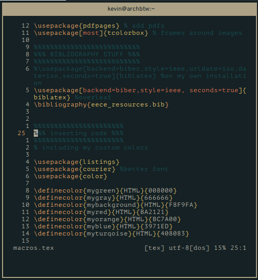

# README

My init.vim config for neovim, its mostly setup for typesetting document with groff/LaTeX/markdown as well as some python and C programming.

## note

to use these you must install [vimplug](https://github.com/junegunn/vim-plug) then run ``:PlugInstall``

## changes

- removed lots of plugins
- using a pure vim status line
- made the file a little more neat
- split big parts into their own files (``macros.vim``, ``coc.vim``, and ``statusline.vim``)

